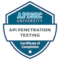

  
  <h1 align="center">
    Hello, I'm Lucas, a rising hacker =)
  </h1>
  

    Here are some <strong>personal projects</strong> I do to improve my skills.
  

  

    
    
  

  

    
    
  
  

